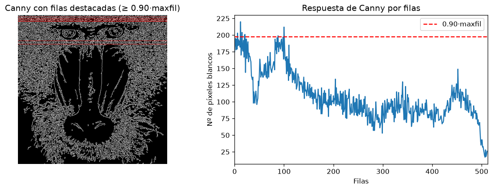
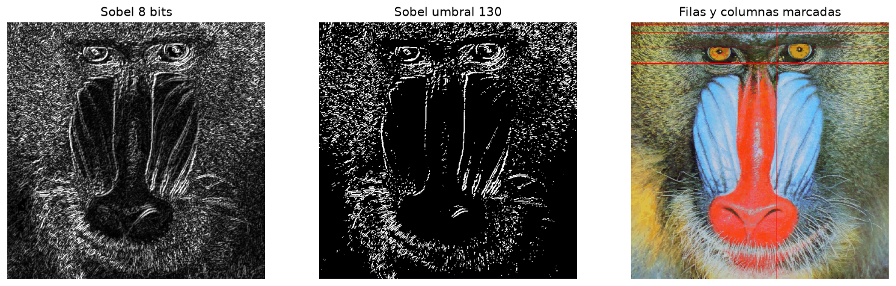
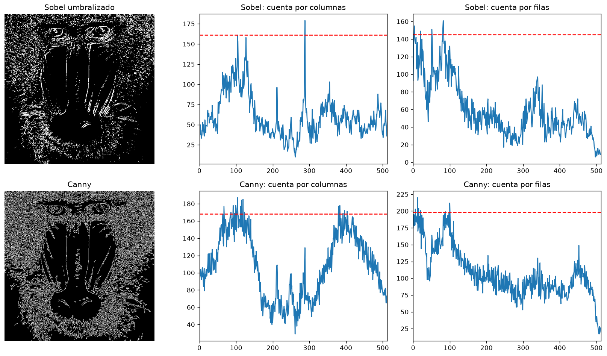
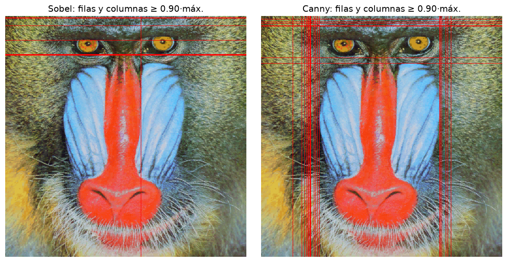
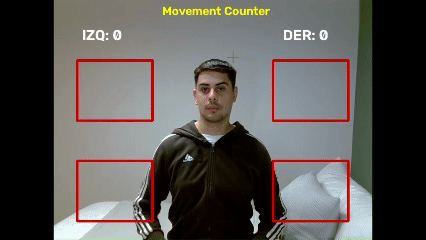
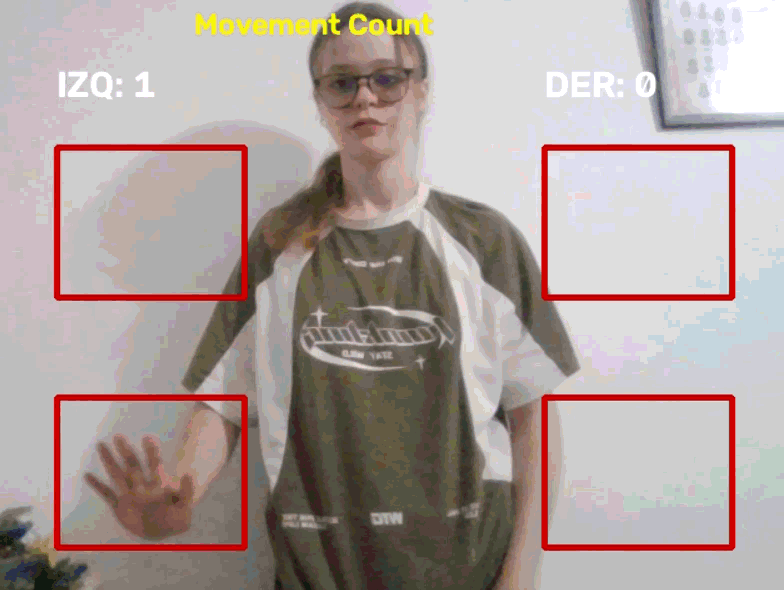

## Práctica 2. Funciones básicas de OpenCV

**Autores:**  [Naiara Díaz Hernández](https://github.com/Naiara262005) y [Alejandro José Martel Torres](https://github.com/AlejandroMartel1)
### Contenidos

[Descripción del trabajo](#descripción-del-trabajo)  
[Tarea 1. Conteo por filas en Canny](#tarea-1-conteo-de-píxeles-de-canny-por-filas)  
[Tarea 2. Sobel umbralizado y comparación con Canny](#tarea-2-sobel-umbralizado-y-comparación-con-canny)  
[Tarea 3. Movement Counter](#tarea-3-movement-counter)  
[Fuentes y herramientas utilizadas](#fuentes-y-herramientas-utilizadas)

### Descripción del trabajo

El cuaderno entregado (*Tareas_P2.ipynb*) contiene únicamente la resolución de las tres tareas propuestas en el cuaderno de la práctica, con una celda de contextualización antes de cada celda de código.

- **Tarea 1:** recuento de píxeles empleando Canny por filas y resaltado de las filas dominantes.
- **Tarea 2:** umbralizado de Sobel, recuento por filas y columnas, marcado sobre la imagen y comparación con Canny.
- **Tarea 3:** demostrador interactivo con webcam tomando como referencia una de las propuestas.

Las dos primeras tareas trabajan sobre la siguiente imagen:

  
    
  <em>Imagen sin modificar del mandril, que destaca por el contraste de sus colores.</em>

                            

### Tarea 1. Conteo de píxeles de Canny por filas

En esta primera tarea, se han analizado las filas de la imagen procesada del mandril aplicando Canny para encontrar el mayor número de bordes. Para ello, se han realizado las siguientes operaciones:

1.  Utilizar `cv2.reduce` para contabilizar el número de píxeles blancos por fila, suma cada fila (con `dim=0` se sumaría por columnas) y se normaliza el valor.
2. Se estable un `maxfil`, que es representa el máximo de dicho vector y el umbral de selección es `0.90*maxfil`.
3. Se utiliza `np.where` para devolver las posiciones de las filas que cumplen la condición anterior; se imprimen su número y sus índices.
4. La imagen de Canny se convierte a tres canales y sobre ella se trazan líneas rojas con `cv2.line` en las filas seleccionadas.
5. Se representa gráficamente el recuento de filas con la línea del umbral.

  
   
  <em>Resultado de aplicar Canny para un umbral superior a 0.90.</em>

### Tarea 2. Sobel umbralizado y comparación con Canny

En esta segunda tarea se ha umbralizado la salida de Sobel (8 bits), contando píxeles no nulos por filas y columnas, determinando las filas y columnas por encima de `0.90*máximo`, para remarcarlas sobre la imagen del mandril y comparar los resultados con los de Canny. Para realizarlo, se han aplicado las siguientes transformaciones:

1. Se calcula Sobel sobre la imagen suavizada con una gaussiana 3×3 y se convierte a 8 bits con `cv2.convertScaleAbs`.
2. Se umbraliza con `cv2.threshold` (valor 130, `THRESH_BINARY`).
3. Se cuentan los píxeles no nulos por columnas (`cv2.reduce` con `dim=0`) y por filas (`dim=1`), obteniendo el número absoluto de píxeles de la misma forma que en la tarea 1.
4. Se calculan el máximo de cada cuenta y las filas y columnas con valor `>= 0.90*máximo`.
5. Se dibuja una línea horizontal en cada fila seleccionada de la imagen del mandril y una vertical en cada columna seleccionada.
6. Por último, se repite exactamente el mismo procedimiento sobre la salida de Canny y se muestran juntos los resultados, las marcas sobre el mandril y una tabla resumen (píxeles de borde y nº de filas y columnas seleccionadas).

  
    
  <em>Representación de Sobel en 8 bits,  umbralizado a 130, así como, filas y columnas seleccionadas para valores mayores a  0.90·max sobre el mandril.</em>

  
   
  <em>En la mitad superior de la imagen se representan los píxeles de borde por columnas y por filas con Sobel umbralizado, mostrándose en la mitad inferior Canny. La línea discontinua roja indica el umbral de 0.90·máx.</em>

  
   
  <em>Filas y columnas detectadas con Sobel y Canny para valores iguales o superiores al umbral. </em>

**Comparativa de la aplicación de Sobel frente a Canny**

 Partiendo del análisis con Canny, gracias a la supresión de no máximos, produce bordes de un píxel de grosor, mientras que Sobel umbralizado conserva todo píxel cuyo gradiente supera el valor umbral, logrando esto obtener unos bordes más gruesos. Aun así, con los umbrales usados (130 para Sobel y 100/200 para Canny), Canny marca más píxeles (55509 frente a 31199) y destaca 19 columnas frente a 1 de Sobel. Esto se debe a que Sobel depende de un único umbral y es sensible a él (y a la textura), mientras que Canny emplea dos umbrales y es más robusto frente al ruido. Por otra parte, Sobel es más simple y rápido. Las filas y columnas destacadas no tienen por qué coincidir entre ambos detectores; cuando esto sucede indica que estamos ante estructuras significativamente marcadas en la misma.

### Tarea 3. Movement Counter

En esta tercera tarea, partimos de la inspiración de **Virtual Air Guitar**, donde al ubicar las manos en distintas zonas del espacio genera una respuesta. Tomando esto como referencia hemos intentado crear una propuesta interactiva que tenga un punto divertido y útil, que se entrelaza con el recuerdo de juegos propios de Wii donde el movimiento era el protagonista. 

Para ello, hemos creado un contador de movimiento, que contabiliza como repetición válida cuando se pasa la mano de la caja inferior a la superior, pudiendo actuar así como un contador fitness que captura el número de repeticiones realizadas con una mancuerna, evaluando los dos brazos de forma independiente. Estos cambios se perciben visualmente con el cambio de color de las cajas que pasan de rojo (inactiva) a verde (activa) y el contador de cada brazo se muestra en pantalla, todo esto se ha realizado aplicando las siguientes técnicas:

| Técnica | Uso en el demostrador |
|:---:|:---:|
| `cv2.absdiff` entre fotogramas consecutivos | detectar qué cambia en la imagen (movimiento) |
| `cv2.threshold` (umbral 25) | binarizar la diferencia y descartar el ruido del sensor |
| *Slicing* de NumPy | aislar cada caja (ROI) y contar los píxeles en movimiento solo dentro de ella |
| `cv2.flip`, `cv2.resize` | efecto espejo y resolución fija de 640×480 para que las coordenadas de las cajas sean constantes |
| `cv2.rectangle`, `cv2.putText` | cajas de interacción y contadores |
| Estado por brazo (`abajo` / `arriba`) | contar repeticiones completas (abajo → arriba) y no movimientos sueltos |

Como demostración gráfica, hemos creado dos animaciones donde hacemos uso de la herramienta:

  
   
  <em>Demostración del contador de movimiento realizado por Alejandro, reseteando el contador al finalizar.</em>

  
   
  <em>Demostración del contador de movimiento realizado por Naiara.</em>

**Uso del Movement Counter:** de forma ideal debemos alejarnos al menos un metro de la cámara de forma que las manos queden dentro de las cajas al subir y bajar los brazos. Asimismo, para salir se pulsa ESC para terminar y la tecla r para reiniciar los contadores (es válida la r tanto mayúscula como minúscula, se ha utilizado esta tecla en referencia al término "reset").

### Fuentes y herramientas utilizadas

- Enunciado y cuaderno base de la práctica 2, Visión por Computador, ULPGC. El código de preparación (grises, Canny, Sobel y conversión a 8 bits) parte de los ejemplos de dicho cuaderno.
- Propuestas de la tarea 3; [My little piece of privacy](https://www.niklasroy.com/project/88/my-little-piece-of-privacy) (Niklas Roy), [Messa di voce](https://youtu.be/GfoqiyB1ndE?feature=shared) (Golan Levin y Zachary Lieberman) y [Virtual air guitar](https://youtu.be/FIAmyoEpV5c?feature=shared). Se tomó como punto de partida esta última.

- Se utilizó gemini en algunos momentos para corregir errores (variables sin definir entre celdas, ejes de gráficas o color de las marcas en RGB). Asimismo, también se hicieron consultas relativas la readme, por ejemplo, si insertar un gif se hacia de la misma forma que una imagen.

****
- [Canny Edge Detection](https://docs.opencv.org/4.x/da/d22/tutorial_py_canny.html)
- [Sobel Derivatives](https://docs.opencv.org/4.x/d2/d2c/tutorial_sobel_derivatives.html)
- [Image Thresholding](https://docs.opencv.org/4.x/d7/d4d/tutorial_py_thresholding.html)
- [Matplotlib](https://matplotlib.org)
